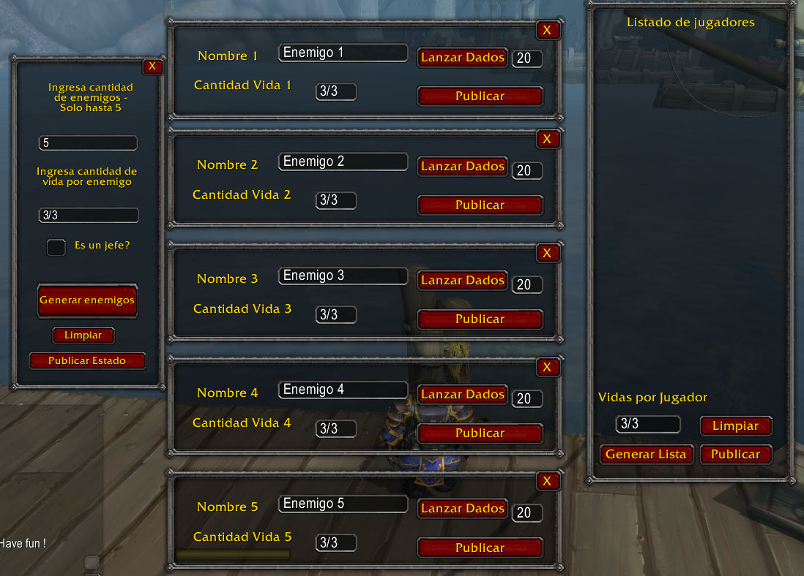

# HelperRP
Un Addon para World of Warcraft

## Descripción 

Este addon busca ayudar a todos aquellos que se dedican al role play dentro de WoW, para matener un estado de enemigos y jugadores lo mas visible para
al grupo y ahorra tiempo de escritura.

El addon costa de dos paneles principales generar enemigos y listado de jugadores.
  - Generar enemigos esta limitado a cinco.
  - Cada panel de enemigos tiene su propio panel para editar el nombre el estado de vidas y la cantidad de dados que puede lanzar.
  - La opción 'Es un jefe?' aun no esta implementada.
  - En listado de jugadores el boton generar lista obtiene el nombre del personaje perteneciente a un grupo y/o banda en la que se encuentra.
  - Los botones publicar envian una 'alerta de banda' con los estados de enemigos y listado jugadores segun corresponda.
  - Para utilizar los botones publicar se requerira ser lider de grupo/banda o tener asistente de banda.
  
  
  
  ## Hecho con...
  
  - [Addon studios 2015]( https://addonstudio.fandom.com/wiki/AddOn_Studio_2015_for_World_of_Warcraft )- Herramienta de desarrollo para addons de wow
